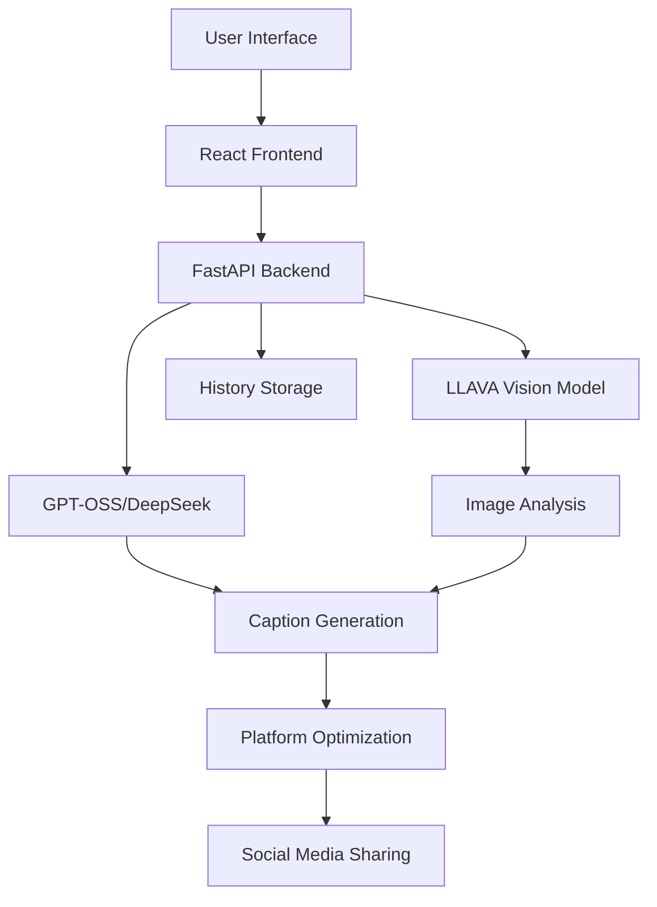

# 🚀 caption-craft.ai : AI-Powered Social Media Caption Generator

<div align="center">

> **Transform your images into engaging social media content with cutting-edge AI technology**

[](https://python.org)
[](https://reactjs.org)
[](https://fastapi.tiangolo.com)
[](https://typescriptlang.org)
[](https://docker.com)

</div>

---

## 🎯 **Project Overview**

The **AI-Powered Social Media Caption Generator** is a revolutionary full-stack web application that leverages state-of-the-art artificial intelligence to transform ordinary images into compelling social media content. Built with modern web technologies and advanced AI models, this application provides intelligent, platform-specific caption generation for Instagram, Facebook, and LinkedIn.

### 🌟 **Why This Project Matters**

In today's digital landscape, creating engaging social media content is crucial for personal branding, business growth, and community building. However, crafting the perfect caption that resonates with your audience while maintaining platform-specific best practices can be time-consuming and challenging. This application democratizes high-quality content creation by making AI-powered caption generation accessible to everyone.

## ✨ **Core Features**

### 🤖 **Advanced AI Integration**
- **LLAVA 7B Vision Model**: State-of-the-art image analysis with detailed scene understanding
- **GPT-OSS 120B**: Large language model for sophisticated caption generation
- **DeepSeek-R1**: Alternative reasoning model for diverse content creation
- **Transparent AI Reasoning**: View the AI's decision-making process with `<think></think>` tags
- **Multi-Model Support**: Switch between different AI models for varied results

### 📱 **Platform-Specific Optimization**
- **Instagram**: Trendy, aesthetic-focused captions with strategic emojis and hashtags
- **Facebook**: Community-oriented, conversational tone with engagement-focused content
- **LinkedIn**: Professional, thought-leadership content with industry-relevant insights
- **Smart Adaptation**: AI automatically adjusts tone, style, and hashtags for each platform

### 🎯 **Five Caption Styles**
- **SHORT**: Concise, punchy captions perfect for quick engagement
- **STORY**: Narrative, storytelling approach that draws readers in
- **PHILOSOPHY**: Deep, thought-provoking content that sparks reflection
- **LIFESTYLE**: Aspirational, lifestyle-focused content that inspires
- **QUOTE**: Inspirational, quote-style captions that motivate and uplift

### 🚀 **User Experience Features**
- **Drag & Drop Interface**: Intuitive file upload with visual feedback
- **Real-time Processing**: Live progress indicators during AI analysis
- **Dark/Light Mode**: Beautiful, responsive UI with theme switching
- **History Management**: Save, organize, and revisit your generated captions
- **Smart Sharing**: Direct integration with social media platforms
- **Duplicate Detection**: Intelligent image deduplication using SHA-256 hashing

## 🏗️ **System Architecture**

### 📊 **High-Level Architecture**



### 🗂️ **Project Structure**

```
📁 AI-Caption-Generator/
├── 📁 backend/                    # FastAPI Backend Server
│   ├── 📄 main.py                # Core API endpoints and logic
│   ├── 📄 requirements.txt       # Python dependencies
│   ├── 📄 Dockerfile            # Backend container configuration
│   ├── 📄 setup.py              # Environment setup script
│   ├── 📁 uploads/               # Temporary file storage
│   └── 📄 history.json          # Persistent data storage
├── 📁 frontend/                  # React + TypeScript Frontend
│   ├── 📁 src/                   # Source code directory
│   │   ├── 📄 App.tsx           # Main application component
│   │   ├── 📄 main.tsx          # Application entry point
│   │   ├── 📁 pages/            # Page components
│   │   │   ├── 📄 Home.tsx      # Main application page
│   │   │   └── 📄 Result.tsx    # Results display page
│   │   └── 📄 types.d.ts        # TypeScript definitions
│   ├── 📄 package.json          # Node.js dependencies
│   ├── 📄 Dockerfile            # Frontend container configuration
│   ├── 📄 tailwind.config.js    # Tailwind CSS configuration
│   └── 📄 vite.config.mjs       # Vite build configuration
├── 📄 docker-compose.yml         # Multi-container orchestration
├── 📄 setup.py                   # Project setup automation
└── 📄 README.md                  # Project documentation
```

### 🔄 **Data Flow Architecture**

1. **Image Upload** → Frontend receives file via drag & drop
2. **File Validation** → Backend validates file type and size
3. **Hash Calculation** → SHA-256 hash for duplicate detection
4. **AI Analysis** → LLAVA model analyzes image content
5. **Caption Generation** → GPT-OSS/DeepSeek creates platform-specific captions
6. **Result Processing** → Backend formats and optimizes output
7. **User Display** → Frontend presents organized results
8. **History Storage** → JSON-based persistent storage
9. **Social Sharing** → Direct platform integration

## 🚀 **Quick Start Guide**

### 📋 **Prerequisites**

| Requirement | Version | Purpose |
|-------------|---------|---------|
| **Python** | 3.11+ | Backend API development |
| **Node.js** | 18+ | Frontend development |
| **Docker** | Latest | Containerized deployment |
| **Hugging Face API** | Required | AI model access |
| **Ollama** | Latest | Local LLAVA model serving |

### 🔧 **System Requirements**

- **RAM**: Minimum 8GB (16GB recommended for optimal performance)
- **Storage**: 10GB free space for models and dependencies
- **Network**: Stable internet connection for AI model access
- **OS**: Windows 10+, macOS 10.15+, or Linux (Ubuntu 20.04+)

### 📥 **Step 1: Clone the Repository**

```bash
# Clone the repository
git clone https://github.com/Harry-jain/caption-craft.ai.git
cd caption-craft.ai

# Verify the project structure
ls -la
```

### 🐍 **Step 2: Backend Setup**

```bash
# Navigate to backend directory
cd backend

# Create Python virtual environment
python -m venv venv

# Activate virtual environment
# On Windows:
venv\Scripts\activate
# On macOS/Linux:
source venv/bin/activate

# Upgrade pip to latest version
python -m pip install --upgrade pip

# Install Python dependencies
pip install -r requirements.txt

# Configure environment variables
# Option A: Use automated setup script (Recommended)
python ../setup.py

# Option B: Manual configuration
echo "HF_TOKEN=your_huggingface_token_here" > .env
echo "HF_GPT_OSS_MODEL=openai/gpt-oss-120b:together" >> .env

# Start the FastAPI server
uvicorn main:app --host 0.0.0.0 --port 8000 --reload
```

### 🤖 **Step 3: Ollama Setup (Required for Image Analysis)**

```bash
# Install Ollama from https://ollama.ai
# Download the appropriate installer for your OS

# Pull the LLAVA 7B model for image analysis
ollama pull llava:7b

# Start Ollama service in the background
ollama serve &

# Verify the installation and model
ollama list

# Test the model (optional)
ollama run llava:7b "Describe this image" --image /path/to/test/image.jpg
```

### ⚛️ **Step 4: Frontend Setup**

```bash
# Navigate to frontend directory
cd frontend

# Install Node.js dependencies
npm install

# Start the development server
npm run dev

# Alternative: Build for production
npm run build
npm run preview
```

### 🌐 **Step 5: Access the Application**

| Service | URL | Description |
|---------|-----|-------------|
| **Frontend** | http://localhost:5173 | Main application interface |
| **Backend API** | http://localhost:8000 | REST API endpoints |
| **API Documentation** | http://localhost:8000/docs | Interactive API docs |
| **Health Check** | http://localhost:8000/health | Service status |

### ✅ **Verification Steps**

1. **Backend Health Check**: Visit http://localhost:8000/docs
2. **Frontend Loading**: Visit http://localhost:5173
3. **Ollama Status**: Run `ollama list` in terminal
4. **API Connectivity**: Check browser developer tools for API calls

## 🐳 **Docker Deployment**

### 🚀 **Quick Docker Setup**

```bash
# Build and run with Docker Compose (Recommended)
docker-compose up --build

# Run in detached mode
docker-compose up -d --build

# View logs
docker-compose logs -f

# Stop services
docker-compose down
```

### 🔧 **Individual Container Deployment**

```bash
# Build backend container
docker build -t caption-backend ./backend

# Build frontend container
docker build -t caption-frontend ./frontend

# Run backend container
docker run -p 8000:8000 -e HF_TOKEN=your_token_here caption-backend

# Run frontend container
docker run -p 5173:5173 caption-frontend
```

### 📊 **Docker Compose Configuration**

The `docker-compose.yml` file orchestrates the entire application stack:

```yaml
version: '3.8'
services:
  backend:
    build: ./backend
    ports:
      - "8000:8000"
    environment:
      - HF_TOKEN=${HF_TOKEN}
      - HF_GPT_OSS_MODEL=${HF_GPT_OSS_MODEL}
    volumes:
      - ./backend:/app
    command: uvicorn main:app --host 0.0.0.0 --port 8000

  frontend:
    build: ./frontend
    ports:
      - "5173:5173"
    volumes:
      - ./frontend:/app
    command: npm run dev
    depends_on:
      - backend
```

## 🔧 **Configuration & Environment**

### 🔐 **Environment Variables**

| Variable | Description | Required | Default |
|----------|-------------|----------|---------|
| `HF_TOKEN` | Hugging Face API token for AI model access | ✅ Yes | - |
| `HF_GPT_OSS_MODEL` | Primary model for caption generation | ❌ No | `openai/gpt-oss-120b:together` |
| `OLLAMA_URL` | Ollama service endpoint | ❌ No | `http://localhost:11434` |
| `UPLOAD_DIR` | Directory for temporary file storage | ❌ No | `uploads` |

### 🛡️ **Security Best Practices**

- **🔒 API Token Security**: Never commit `.env` files to version control
- **🔄 Token Rotation**: Regularly rotate Hugging Face API tokens
- **📁 File Permissions**: Ensure proper file permissions for upload directories
- **🌐 Network Security**: Use HTTPS in production environments
- **🔍 Input Validation**: All file uploads are validated for type and size

### 🤖 **Available AI Models**

| Model | Provider | Size | Use Case | Performance |
|-------|----------|------|----------|-------------|
| **GPT-OSS 120B** | Together AI | 120B parameters | Primary caption generation | High quality, slower |
| **GPT-OSS 20B** | Together AI | 20B parameters | Faster caption generation | Good quality, faster |
| **DeepSeek-R1** | Fireworks AI | 7B parameters | Alternative reasoning | Fast, diverse output |
| **LLAVA 7B** | Ollama | 7B parameters | Image analysis | Local processing |

## 📱 How It Works

1. **Upload Image**: Drag & drop or select an image file
2. **Choose Platform**: Select Instagram, Facebook, or LinkedIn
3. **Select Model**: Choose between GPT-OSS or DeepSeek-R1
4. **AI Analysis**: LLAVA analyzes the image content
5. **Caption Generation**: AI generates 5 distinct caption types
6. **Review & Share**: Copy captions or share directly to platforms

## 🎨 Caption Types

Each platform generates 5 unique caption styles:

- **SHORT**: Concise, punchy captions with hashtags
- **STORY**: Narrative, storytelling approach
- **PHILOSOPHY**: Deep, thought-provoking content
- **LIFESTYLE**: Aspirational, lifestyle-focused
- **QUOTE**: Inspirational, quote-style captions

## 🔌 API Endpoints

### Image Analysis
```http
POST /api/describe
Content-Type: multipart/form-data

file: [image file]
```

### Caption Generation
```http
POST /api/caption
Content-Type: application/json

{
  "description": "image description",
  "image_name": "filename.jpg",
  "image_hash": "optional_hash",
  "tone": "instagram|facebook|linkedin",
  "model_id": "optional_model_override"
}
```

### History Management
```http
GET /api/history          # Get all captions
GET /api/history/{id}     # Get specific caption
DELETE /api/history/{id}  # Delete caption
DELETE /api/history       # Clear all history
```

## 🛠️ Tech Stack

### Backend
- **FastAPI**: Modern, fast web framework
- **Python 3.11+**: Latest Python features
- **Hugging Face**: AI model inference
- **LLAVA**: Vision-language model for image analysis
- **OpenAI Client**: Router API integration

### Frontend
- **React 18**: Modern React with hooks
- **TypeScript**: Type-safe development
- **Tailwind CSS**: Utility-first styling
- **Vite**: Fast build tool
- **React Router**: Client-side routing

### AI Models
- **LLAVA 7B**: Image recognition and description
- **GPT-OSS 120B**: Advanced caption generation
- **DeepSeek-R1**: Alternative caption model

## 🌟 Key Features

### Smart Platform Adaptation
- **Instagram**: Trendy, aesthetic-focused with strategic emojis
- **Facebook**: Community-oriented, conversational tone
- **LinkedIn**: Professional, thought-leadership content

### Advanced AI Reasoning
- View the AI's thought process with `<think></think>` tags
- Understand how captions are adapted for each platform
- Transparent AI decision-making

### Seamless Sharing
- Direct platform integration
- Optimized content for each social network
- Copy-to-clipboard functionality

## 📊 Performance

- **Image Analysis**: ~5-10 seconds with LLAVA
- **Caption Generation**: ~10-20 seconds with GPT-OSS
- **Response Time**: Optimized for real-time interaction
- **Scalability**: Docker-ready for production deployment

## 🤝 Contributing

We welcome contributions! Please see our [Contributing Guide](CONTRIBUTING.md) for details.

### Development Setup

1. Fork the repository
2. Create a feature branch
3. Make your changes
4. Add tests if applicable
5. Submit a pull request

## 📝 **Project Information**

This project is developed as a comprehensive demonstration of modern AI integration with full-stack web development. The application showcases advanced capabilities in computer vision, natural language processing, and user experience design.

## 🙏 Acknowledgments

- **Hugging Face** for providing the AI models
- **Together AI** for GPT-OSS model hosting
- **Fireworks AI** for DeepSeek-R1 hosting
- **Open Source Community** for the amazing tools

## 📞 Support

- **Issues**: [GitHub Issues](https://github.com/Harry-jain/caption-craft.ai/issues)
- **Discussions**: [GitHub Discussions](https://github.com/Harry-jain/caption-craft.ai/discussions)
- **Email**: harry.jain@example.com

## 🔮 Roadmap

- [ ] Multi-language support
- [ ] Video caption generation
- [ ] Advanced hashtag optimization
- [ ] Social media scheduling integration
- [ ] Team collaboration features
- [ ] Analytics and insights

## 🚨 Troubleshooting

### Common Issues

#### 1. "Ollama service not available" Error
```bash
# Install Ollama
# Download from: https://ollama.ai

# Pull LLAVA model
ollama pull llava:7b

# Start service
ollama serve

# Verify in another terminal
ollama list
```

#### 2. "HF_TOKEN not set" Error
```bash
# Create .env file in backend/ directory
echo "HF_TOKEN=your_actual_token_here" > backend/.env
echo "HF_GPT_OSS_MODEL=openai/gpt-oss-120b:together" >> backend/.env
```

#### 3. Frontend Build Errors
```bash
# Clear node_modules and reinstall
cd frontend
rm -rf node_modules package-lock.json
npm install
```

#### 4. Port Already in Use
```bash
# Check what's using the port
netstat -ano | findstr :8000  # Windows
lsof -i :8000                 # Mac/Linux

# Kill the process or use different port
uvicorn main:app --host 0.0.0.0 --port 8001 --reload
```

---

<div align="center">
  <p>Made with ❤️ by Harsh Jain</p>
  <p>⭐ Star this repo if you found it helpful!</p>
</div>
